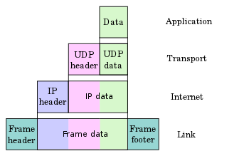
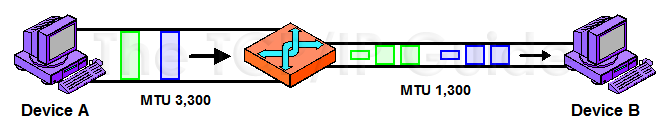
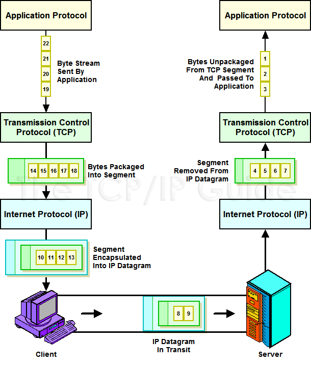
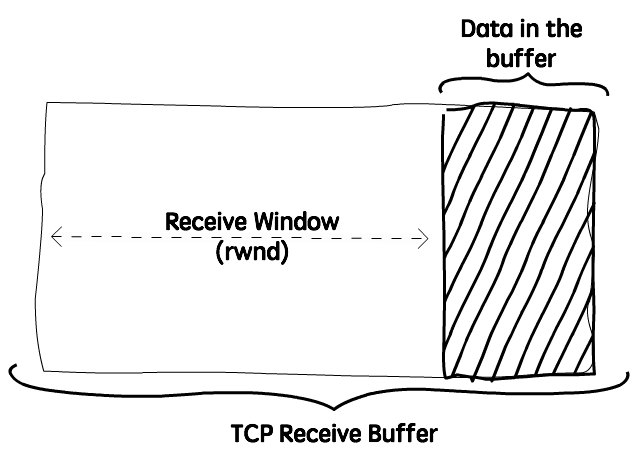
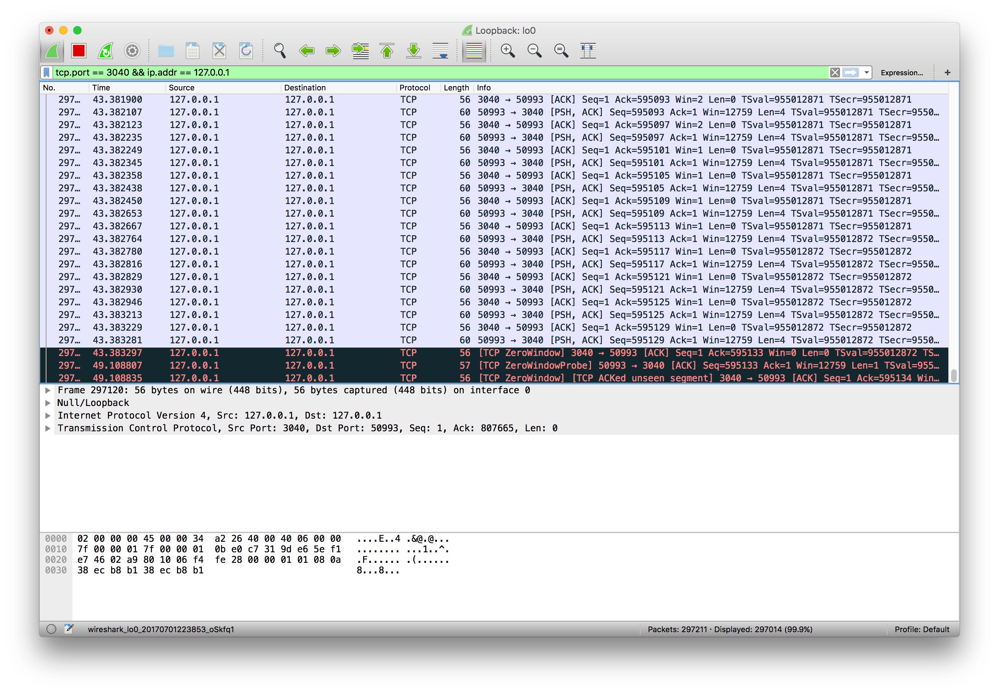
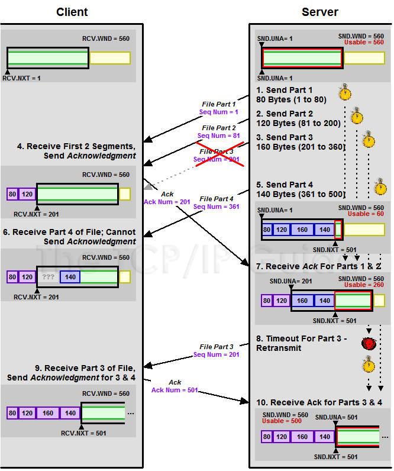

# Computer-Networks

Заметки по изучению компьютерных сетей

# Internet protocol suite (TCP/IP)

Internet protocol suite - это концептульная модель и набор протоколов используемых в интернете и похожих компьютерных сетях. Эта модель наиболее известна как TCP/IP потому что в ее основе лежат именно TCP и IP. 

Модель описывает способ передачи данных от источника информации к получателю (end-to-end data communication). Модель предпологает прохождение через четыре уровня абстракции, которые классифицируют все используемые протоколы в зависимости от их зоны ответственности и объема задействованных сетей.

Эти уровни с самого низкого до высокого:
1. Канальный уровень (Link Layer) - описывает способ передачи данных на физическом уровне в рамках одного сегмента сети. Пример протоколов - Ethernet, IEEE 802.11
2. Сетевой (межсетевой) уровень (Internet layer) - описывает способ передачи данных из одной сети в другую. На этом уровне работают маршрутизаторы, которые перенаправляют пакеты в нужную сеть путем расчета адреса сети по маске сети. Пример протокола - IP, ICMP.
3. Транспортный уровень (Transport Layer) - способ передачи данных от одного хоста к другому. На этом уровне могут решаться проблемы негарантированной доставки сообщений, а также гарантироваться правильный порядок прихода пакетов. На этом уровне определяется, для какого именно приложения предназначены данные. Пример протокола - TCP, UDP. Для определения протокола верхнего уровня на данном уровне используется число, называемое *портом*.
4. Прикладной уровень (Application Layer) - способ передачи данных между процессами для приложений. На данном уровне используются такие протоколы как HTTP, FTP, SMTP, SSH, DNS. Эти протоколы в основном работают поверх TCP или UDP и привязаны к определенному порту.

## PDU, SDU

Данные в TCP/IP передаются от верхнего уровня к нижнему и каждый уровень должен обслужить данные свыше. Пример инкапсуляции данных при прохождении через уровни TCP/IP:

Здесь существуют такие понятия как PDU и SDU.

**PDU (Protocol Data Unit)** - это конечное сообщение, которым оперирует определенный уровень N. Однако, когда это сообщение передается на уровень ниже (N-1), оно становится SDU для этого уровня.

**SDU (Service Data Unit)** - это данные, переданные от верхнего уровня N, которые должен обслужить (service) уровень N - 1.

То есть, каждый уровень ниже просто оборачивает данные свыше в свою структуру, добавляя необходимые хэдеры и другие поля.

## Отличия модели TCP/IP от OSI

Три верхних уровня в модели OSI не разделяются в TCP/IP (application layer, presentation layer и session layer) и объединены в Application Layer. Два нижних уровня в модели OSI также не разделяются в TCP/IP (link layer, physical layer) и объединены в Link Layer. Уровни Internet Layer и Transport Layer почти не изменены.

---

# Сетевой уровень

## IP Layer

### MTU, Fragmentation

*MTU (Maximum Transmission Unit)* - это максимальный размер IP датаграммы, который может обслужить данная сеть. 

Если после добавления IP хэдеров общий размер пакета получается больше MTU, то при передаче от сети с высоким MTU к сети с низким MTU, это сообщение фрагментируется в несколько IP фрагментов.

*Минимальное значение MTU*, заданное стандартом, равно 576 байт.

#### MTU Path Discovery

**MTU Path Discovery** - это процесс определения значения MTU на другой стороне сети. Нам требуется такая возможность, так как изначально сеть не знает значения MTU другой стороны, а также потому, что нам важно подобрать оптимальное значение MTU и по возможности как можно большее (так как чем больше IP датаграмма, тем меньше байтов тратятся на такой overhead как хэдеры для фрагментированных пакетов), удовлетворяющее обе сети, чтобы повысить производительность и избежать фрагментации данных.

---

# Транспортный уровень (Transport Layer)

## TCP

**TCP** - это гарантированный транспортный механизм с предварительным установлением соединения (рукопожатия - handshake), предоставляющий приложению надежный поток данных и дающий гарантию в безошибочности получаемых данных. TCP имеет механизм для регулирования нагрузки на сеть. Более того, TCP гарантирует что полученные данные пришли в том же порядке, в котором были отправлены другим хостом. 

## UDP

**UDP (User Datagram Protocol)** - протокол передачи пакетов (называемыми датаграммами) без необходимости предварительной установки соединения. UDP в целом испольует простую модель данных, без обеспечения надежности, упорядочивания и целостности данных. Можно сказать, это самый протокол в семействе TCP/IP. Все, что он делает - это берет данные с прикладного уровня, упаковывает их в простой формат данных и передает в IP для передачи по сети.

Природа UDP как протокола без сохранения состояния также полезна для серверов, отвечающих на небольшие запросы от огромного числа клиентов, например DNS и потоковые мультимедийные приложения вроде IPTV, Voice over IP, протоколы туннелирования IP и многие онлайн-игры. Главная особенность этих приложений состоит в том, что старые сообщения очень быстро становятся бесполезными, поэтому лучше получить новое сообщение, чем пытаться переслать старое, а создание соединения занимает больше ресурсов, чем повторная отправка. 

Но если TCP имеет механизм для контроля нагрузки на сеть (лимит сообщений), то UDP нет. Чувствительные к перегрузкам UDP-приложения, которые потребляют значительную часть доступной пропускной способности, могут поставить под угрозу стабильность сети.

Сетевые механизмы были предназначены для того, чтобы свести к минимуму возможные эффекты от перегрузок при неконтролируемых, высокоскоростных нагрузках. Такие сетевые элементы, как маршрутизаторы, использующие пакетные очереди и техники сброса, часто являются единственным доступным инструментом для замедления избыточного UDP-трафика. Однако большинство приложений на самом деле контролируют нагрузку на прикладном уровне.

*DCCP (англ. Datagram Congestion Control Protocol — протокол контроля за перегрузками датаграмм)* разработан как частичное решение этой потенциальной проблемы с помощью добавления конечному хосту механизмов для отслеживания перегрузок для высокоскоростных UDP-потоков вроде потоковых медиа.

## Отличия TCP от UDP

Итак, повторим все отличия TCP от UDP.

TCP:
- Надёжность — TCP управляет подтверждением, повторной передачей и тайм-аутом сообщений. Производятся многочисленные попытки доставить сообщение. Если оно потеряется на пути, сервер вновь запросит потерянную часть. В TCP нет ни пропавших данных, ни (в случае многочисленных тайм-аутов) разорванных соединений.
- Упорядоченность — если два сообщения последовательно отправлены, первое сообщение достигнет приложения-получателя первым. Если участки данных прибывают в неверном порядке, TCP отправляет неупорядоченные данные в буфер до тех пор, пока все данные не могут быть упорядочены и переданы приложению.
- Тяжеловесность — TCP необходимо три пакета для установки сокет-соединения перед тем, как отправить данные. TCP следит за надёжностью и перегрузками.
- Потоковость — данные читаются как поток байтов, не передается никаких особых обозначений для границ сообщения или сегментов.

UDP:
- Ненадёжный — когда сообщение посылается, неизвестно, достигнет ли оно своего назначения — оно может потеряться по пути. Нет таких понятий, как подтверждение, повторная передача, тайм-аут.
- Неупорядоченность — если два сообщения отправлены одному получателю, то порядок их достижения цели не может быть предугадан.
- Легковесность — никакого упорядочивания сообщений, никакого отслеживания соединений и т. д. Это небольшой транспортный уровень, разработанный на IP.
- Датаграммы — пакеты посылаются по отдельности и проверяются на целостность только если они прибыли. Пакеты имеют определенные границы, которые соблюдаются после получения, то есть операция чтения на сокете-получателе выдаст сообщение таким, каким оно было изначально послано.
- Нет контроля перегрузок — UDP сам по себе не избегает перегрузок. Для приложений с большой пропускной способностью возможно вызвать коллапс перегрузок, если только они не реализуют меры контроля на прикладном уровне.
    
### TCP Fundamentals

#### Streams, Segments, MSS и Sequence Numbers

Важно отметить, что TCP является *стриминговым (stream)* протоколом, в отличие от UDP, который оперирует отдельными блоками данных. Но в TCP нет разделения данных - сокет принимает просто поток байтов и передает их на другую сторону соединения, где они будут уже преобразованы в необходимую структуру и прочитаны. 
Это позволяет избежать создания чанков (chunk) на стороне приложения, когда они сами по себе не имеют смысла, а являются частью большого объекта.

Конечно же, TCP не может взять и передать весь поток байтов за один раз. Более того, нижний уровень (сетевой) - IP - не является стриминговым, а оперирует отдельными сообщениями. Для этого TCP разбивает поток данных на *сегменты (segments)*.

##### MSS

Здесь также существует такой термин как *MSS (Maximum Segment Size)* - максимальный размер сегмента. Он задается при установке соединения. Если receiver может байт меньше, чем MSS, то сегмент не должен превышать значение на стороне receiver-а.

На самом деле, этот термин немного путает - в действительности MSS обозначает количество данных, которые могут упаковаться в сегмент и не учитывает TCP хэдеры. Например, если MSS равен 100, то TCP сегмент может быть размером 120 байт или больше.

Выбор MSS основывается в основном на следующих факторах:
- Overhead Management - TCP хэдер забирает 20 байт (или больше), IP хэдер также забирает 20 байт. это означает что минимум 40 байт требуется для хэдеров, и эти байты, не являющиеся полезной нагрузкой (payload), по сути являются overhead так как посылаются в каждом сегменте. Если установить MSS слишком низким - допустим, 40 байт, - то максимум 50% размера пакета могут быть полезными данными - а остальное просто headers.
- IP Fragmentation - TCP сегменты упаковываются в IP пакеты. IP пакеты также имеют свои проблемы связанные с максимальным размером пакета - вспоминаем MTU и фрагментацию. Фрагментация снижает эффективность и повышает риски потери TCP сегмента, что выливается в то, что весь сегмент придется пересылать.

*Дефолтное значение MSS* - это 536. Оно получается путем вычитания 40 байт (TCP хэдеры + IP хэдеры) из значения минимального MTU (576).

Устройства могут использовать более высокое значение MSS, если они уверены в том, что MTU сетей могут пересылать пакеты больше 576 байт. Для определению оптимального значения MSS, в свою очередь, используется процесс MTU Path Discovery.

##### Sequence Numbers

Да, TCP воспринимает данные как поток байтов, однако нам требуется идентификация байтов посланных в пакетах (сама же идентификация требуется для отслеживания данных, которые сокет получает от приложения, чтобы обеспечить гарантию что они будут получены receiver-ом). Для этого в хэдере задается *Sequence Number* - порядковый номер первого байта из данных, которые передаются в текущем сегменте. 

Если же требуется разделять данные в посылаемом стриме (то есть отделять один элемент данных от другого), то приложение должно позаботиться об этом само и вставлять в данные определенный delimiter, согласованный с другой стороной (например multipart/form-data).

#### Установка соединения (Handshake)

В протоколе TCP процедура установки соединения получила название трёхэтапное рукопожатие (three-way handshake). Данная процедура проходит три шага:
1. Клиент посылает пакет SYN (сокр. Synchronize), сообщая этим о желании установки соединения
2. Сервер отвечает пакетом SYN-ACK (Synchronize-Acknowledge), если способен обработать запрос и принять новое соединение
3. Клиент подтверждает приём пакета SYN-ACK пакетом ACK. На этом процедура установления соединения завершается.

Протокол TCP имеет потенциальную уязвимость, обусловленную тем, что нарушитель, устанавливая фальшивые IP-адреса отправителя, может послать серверу множество пакетов SYN. При получении пакета SYN сервер выделяет часть своих ресурсов для установления нового соединения. Обработка множества пакетов SYN рано или поздно затребует все ресурсы сервера и сделает невозможной обработку новых запросов. Такой вид атак называется [SYN flood](https://ru.wikipedia.org/wiki/SYN-%D1%84%D0%BB%D1%83%D0%B4).

#### TCP Sliding window Acknowledgement system

Почему нам вообще понадобилась надежность передачи данных и их упорядоченность? Потому что при передаче по сети может произойти много ошибок, сообщение может не дойти или дойти поврежденным, IP не гарантирует целостности или порядка сообщений. Именно поэтому нам понадобился такой протокол как TCP, чтобы избавить нас от необходимости следить за всем этим. Все, что нам надо сделать для знания того, что данные придут как нужно - это писать в открытый TCP сокет. 

Итак, с какими проблемами справляется TCP:
- Overlapping Transmissions - разрешение ситуации когда посылается множество запросов и ответов в быстром режиме
- Acknowledgment of Multiple Segments - когда одним запросом со стороны receiver-а подтверждается сразу несколько пакетов, которые послал sender
- Fluctuating Window Sizes For Flow Control - контроль размера окна для Back Pressure
- Lost Transmissions - восстановление потерянных пакетов
- Congestion Handling and Avoidance - контроль и избежание congestion (перегрузка сети).

Давайте поговорим о том, как TCP делает свою магию. Все скрыто в *TCP Sliding window Acknowledgement system*.

**TCP Sliding window Acknowledgement system** - это усовершенствованная версия *PAR* (Positive Acknowledgment with Retransmission). **Par**, в свою очередь, это система которая ожидает подтверждения получения посланного сообщения, причем следующее сообщение не может послаться, пока не придет подтверждение, то есть работа синхронная. Если подтверждения не приходит в течение какого-то таймаута, то сообщение посылается снова. Очевидно, такая система является медленной. TCP базируется на ней, но сильно модифицирует.

##### Flow Control

Flow Control гарантирует, что sender не перегрузит receiver посылая пакеты быстрее чем receiver может их читать. Обычно это называется Back-Pressure в распределенных системах.

Чтобы контролировать количество данных, которые может послать sender, receiver сообщает о своем значении *Receive Window (Send Window, Window)*, то есть свободном месте в буфере.

Каждый раз когда receiver получает пакет данных, он должен отправить `ACK` сообщение sender-у, подтверждая получение пакета, а вместе в ACK сообщении он также должен отправить оставшееся свободное место в буфере.

Здесь вступает в дело такое понятие как **The sliding Window**.

Итак, допустим что мы установили соединения между сокетами A (sender) и B (receiver). Нам необходимо передать 150000 байт по сети. B сообщает, что его Receive Window равен 45000 байт. Тогда это означает, что A может отправить без опаски перегрузить B 100 пакетов по 1500 байтов каждый. Если, допустим, B посылает `ack` для первых 10 пакетов и Receive Window все еще равен 45000 (что означает, что приложение на стороне B уже прочитало данные из буфера). Тогда A может отправить еще 10 пакетов, дополняя количество пакетов, находящихся *"в полете"* (то есть отправленных, но еще не были подтверждены), обратно до 30 (то есть лимита, определенного значением Receive Window).

(пример sliding window - как только пакет 3 будет подтвержден (acked), мы можем сдвинуться вправо и отправить пакет 8)

Теперь, допустим, клиент на стороне B начинает читать медленнее. Тогда если еще следующие 10 пакетов были подтверждены (и в полете находятся 20 пакетов, то есть 30000 байт), но receive window в `ack` ответе равен 30000 байт, то мы не можем отправить еще пакеты, так как в полете находятся столько же байт сколько B может принять.

**А что же происходит в таком случае с приложением, которое пишет в TCP output socket (то есть пишет в send buffer)?** Если сокет блокирующий, то при заполнении send buffer (что как раз происходит, если receiver не мог читать быстрее, чем мы писали), приложение тоже блокируется, пока не освободится место в сокете. Тогда мы можем использовать non-blocking I/O, мультиплексирование, или async I/O. Тут же отмечу, что и читающее приложение может заблокироваться, если sender пишет медленнее, чем received может читать - если используются блокирующие сокеты (то есть recv() блокируется, ожидая данных в receive buffer).

Здесь существует проблема, если B сообщает что receive windows равен 0, но не посылает больше ack сообщений (или ack теряется), A никогда не узнает может ли он посылать данные снова. То есть мы имеем deadlock ситуацию.

Чтобы решить эту проблему, когда A встречает receive window равное 0 он запускает *Persist Timer*, который периодически посылает маленький пакет receiver-у (обычно называется WidowProbe), поэтому имеет возможность встретить receive window не равное 0 и продолжить посылать сообщения.

##### Порядок и надежность данных, Retransmission, Multiple Segments Acknowledgment 

**А как же соблюдаются порядок и надежность данных?**

Обычно при использовании **PAR** отправитель посылает сообщение и блокируется, ожидая Acknowledgment в ответ. Однако это неэффективно, так как блокируясь, мы не можем послать еще данных. TCP улучшает стандартный алгоритм PAR и использует для посланных пакетов так называемое *Sequence Number*, которое позволяет идентифицировать сегменты данных и знать, к какому сегменту данных относится `ack` ответ, в котором указывается Acknowledgment Number. Более того, TCP может использовать всего 1 ACK ответ сразу для нескольких посланных пакетов. Так, если были посланы байты 32-34, 35-36, 37-41 и 42-45, то при получении ACK с *Acknowledgment Number* = 37 мы знаем, что байты 32-36 успешно переданы. Однако, здесь есть нюанс: даже если байты 42-45 пришли, но 37-41 - нет, то подтверждения для 45 байта не придет, так как это означало бы, что байты 37-41 тоже пришли, чего на самом деле не было.

Поэтому, как и любая PAR система, TCP для восстановления потерянных пакетов (Lost Transmission) имеет механизм ретрансляции (Retransmission) - после каждой отправки пакета sender запускает Retransmission Timer для этого пакета, который при истечении времени, если подтверждение не пришло, пересылает этот пакет данных. Тогда по истечении некоторого времени байты 37-41 отправятся снова.

В итоге, TCP хранит в сегменте данных следующие важные хэдеры:
- Sequence Number: определяет порядковый номер первого байта из данных, которые передаются с стороны sender'а
- Acknowledgment Number: определяет порядковый номер первого байта из данных, которые ожидается для приема на стороне receiver'а, что также означает что все байты меньше этого значения уже были получены. Например, если двумя запросами отправлены пакеты с seq = 1 с размером сегмента 80 байт и seq = 81 с размером сегмента 120 байт, то при получении ответа ack с Acknowledgment Number=201 мы знаем, что 200 байт успешно переданы и можем отправить еще 200 байт.
- Window: размер Receive Window устройства, отправляющего этот сегмент (со стороны receiver - это размер окна receiver-а)

**Пример общения хостов по TCP:**

Что здесь происходит:
1. Сервер и клиент установили соединение и клиент сообщил о своем размере окна в 560 байт
2. Сервер посылает 4 сегмента данных с Seq Num = 1, Seq Num = 81, Seq Num = 201 общим размером 360. Однако 3 сегмент теряется при передаче по сети. При этом сервер отслеживает, сколько байт он уже отправил и также контролирует на своей стороне, сколько он может отправить еще (действие Flow Control)
3. Клиент принимает 2 первых сегмента, сохраняет в буфер и сдвигает свое окно вперед, тем самым он снова может принять 560 байт. После сохранения он отсылает `ACK` с Acknowledgment Number = 201, обозначая что первые 200 байт успешно приняты
4. Сервер посылает еще 4 сегмент с Seq Num = 361. Общий размер теперь равен 500 байт, поэтому сервер может отправить еще 60 байт
5. Клиент принимает 4 сегмент и кладет его в буфер. Однако, клиент кладет его не за 2 сегментом, а располагает его, начиная с Seq Num, указанного в сегменте, то есть начиная с 361 байта. Мы видим, что место которое должно было быть занято 3 сегментом пустует, так как пакет потерялся. Клиент не может отправить `ACK`, так как отсутствует 3 сегмент
6. Сервер принимает `ACK` ответ от клиента для первых 200 байт и смещает свое окно вперед, таким образом сервер может отправить теперь еще 260 байт
7. Исходит время таймаута таймера ретрансляции (Retransmission Timer) для 3 сегмента, и сервер посылает снова 3 сегмент с Seq Num = 201
8. Клиент принимает этот сегмент, располагает его в буфере между 2 и 4 сегментами (т.е. начиная с 201 байта) и отсылает `ACK` с Ack Num = 501, обозначая что все 4 сегмента успешно приняты
9. Сервер принимает `ACK` ответ от клиента и смещает свое окно вперед. Теперь он снова может отправить 560 байт, а клиент принять 560 байт
10. Общение продолжается...

#### Congestion

*Congestion* - это не то же самое, что и Back Pressure (FLow Control в TCP). Flow Control контролирует периодичность (rate) с которой sender может посылать сообщения. Однако, FLow Control контролирует только то, что происходит с устройствами на каждой из сторон TCP соединения, но не контролирует то, что происходит в устройствах *между* ними. Да, следуя абстракции, мы всего лишь соединены "напрямую" с хостом и это не наша забота, так как Transport Layer знает только о другом хосте и ничего о нижних уровнях и маршрутизаторах/кабелях под океаном.
На практике же, то что происходит на Сетевом уровне - очень важно. Если межсетевое взаимодействие (internetwork) становится слишком загруженной, то скорость, с которой передаются TCP пакеты, может снизиться и пакеты могут даже начать теряться. Это и называется **congestion**. TCP для решения этой задачи имеет в себе алгоритм  для того, чтобы подбирать оптимальное время для повторной посылки сообщения.

---

# Ссылки:
- [http://www.tcpipguide.com/free/t_TCPIPTransportLayerProtocolsTransmissionControlPro.htm](http://www.tcpipguide.com/free/t_TCPIPTransportLayerProtocolsTransmissionControlPro.htm)
- [https://www.brianstorti.com/tcp-flow-control/](https://www.brianstorti.com/tcp-flow-control/)

